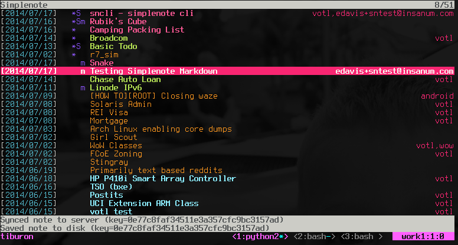
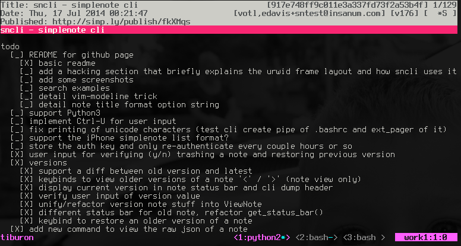
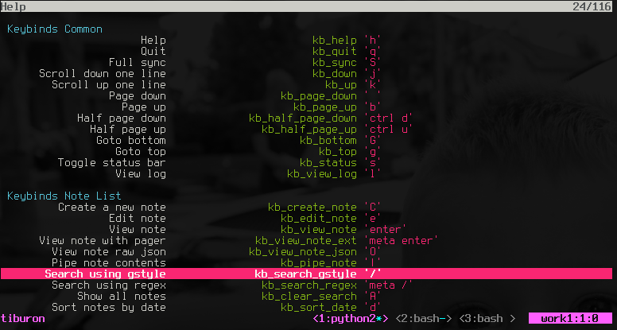
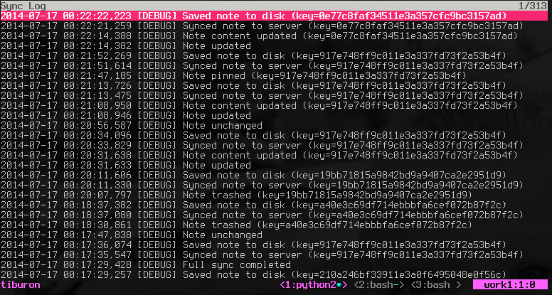

sncli
=====

Simplenote Command Line Interface
[](https://sncli.readthedocs.io/en/latest/?badge=latest)

sncli is a Python application that gives you access to your Simplenote account
via the command line. You can access your notes via a customizable console GUI
that implements vi-like keybinds or via a simple command line interface that
you can script.

Notes can be viewed/created/edited in *both an* **online** *and* **offline**
*mode*. All changes are saved to a local cache on disk and automatically
sync'ed when sncli is brought online.

**Pull requests are welcome!**

Check your OS distribution for installation packages.

### Requirements

* [Python 3](http://python.org)
* [pip](https://pip.pypa.io/en/stable/)
* A love for the command line!

### Installation

* Via pip (latest release):
  - `pip3 install sncli`
* Manually:
  - Clone this repository to your hard disk: `git clone https://github.com/insanum/sncli.git`
  - Pipenv:
    - Install the requirements `pipenv install`
    - Run with `pipenv run sncli`
  - or more manual:
    - `python setup.py install`
  - or with Docker (see the wiki for [Docker usage tips](https://github.com/insanum/sncli/wiki/Tips-and-Tricks#docker-usage-tips))
    - docker build . -t sncli
    - docker run --rm -it -v /tmp:/tmp -v "$HOME/.sncli/:/root/.sncli/" -v "$HOME/.snclirc:/root/.snclirc" sncli


### Features

* Console GUI
  - full two-way sync with Simplenote performed dynamically in the background
  - all actions logged and easily reviewed
  - list note titles (configurable format w/ title, date, flags, tags, keys, etc)
  - sort notes by date, alpha by title, tags, pinned on top
  - search for notes using a Google style search pattern or Regular Expression
  - view note contents and meta data
  - view and restore previous versions of notes
  - pipe note contents to external command
  - create and edit notes (using your editor)
  - edit note tags
  - trash/untrash notes
  - pin/unpin notes
  - flag notes as markdown or not
  - vi-like keybinds (fully configurable)
  - Colors! (fully configurable)
* Command Line (scripting)
  - force a full two-way sync with Simplenote
  - all actions logged and easily reviewed
  - list note titles and keys
  - search for notes using a Google style search pattern or Regular Expression
  - dump note contents
  - create a new note (via stdin or editor)
  - import a note with raw json data (stdin or editor)
  - edit a note (via editor)
  - trash/untrash a note
  - pin/unpin a note
  - flag note as markdown or not
  - view and edit note tags

### Screenshots






### HowTo

```
Usage:
 sncli [OPTIONS] [COMMAND] [COMMAND_ARGS]

 OPTIONS:
  -h, --help                  - usage help
  -v, --verbose               - verbose output
  -n, --nosync                - don't perform a server sync
  -r, --regex                 - search string is a regular expression
  -k <key>, --key=<key>       - note key
  -t <title>, --title=<title> - title of note for create (cli mode)
  -c <file>, --config=<file>  - config file to read from (defaults to ~/.snclirc)

 COMMANDS:
  <none>                      - console gui mode when no command specified
  sync                        - perform a full sync with the server
  list [search_string]        - list notes (refined with search string)
  export [search_string]      - export notes in JSON (refined with search string)
  dump [search_string]        - dump notes (refined with search string)
  create [-]                  - create a note ('-' content from stdin)
  import [-]                  - import a note in JSON format ('-' JSON from stdin)
  export                      - export a note in JSON format (specified by <key>)
  dump                        - dump a note (specified by <key>)
  edit [+line_number]         - edit a note (specified by <key>, optionally jump to line)
  < trash | untrash >         - trash/untrash a note (specified by <key>)
  < pin | unpin >             - pin/unpin a note (specified by <key>)
  < markdown | unmarkdown >   - markdown/unmarkdown a note (specified by <key>)
  tag get                     - retrieve the tags from a note (specified by <key>)
  tag set <tags>              - set the tags for a note (specified by <key>)
  tag add <tags>              - add tags to a note (specified by <key>)
  tag rm <tags>               - remove tags from a note (specified by <key>)
```

#### Configuration

The current Simplenote API does not support oauth authentication so your
Simplenote account information must live in the configuration file or in
the `SN_USERNAME` and `SN_PASSWORD` environment variables.
Please be sure to protect any file containing these secrets.

The flow sncli uses for finding the config file is:

1. Specified on the command line with `-c` or `--config`.
2. If `SNCLIRC` environment variable is set, use that.
3. Finally will pull from default location of `$HOME/.snclirc`.

The following example `.snclirc` will get you going (using your account information):

```
[sncli]
cfg_sn_username = lebowski@thedude.com
cfg_sn_password = nihilist
```
Or, if using environment variables, run `sncli` like this:
``` shell
SN_USERNAME=lebowski@thedude.com SN_PASSWORD=nihilist ./sncli
```

Start sncli with no arguments which starts the console GUI mode. sncli with
start sync'ing all your existing notes and you'll see log messages at the
bottom of the console. You can view these log messages at any time by pressing
the `l` key.

View the help by pressing `h`. Here you'll see all the keybinds and
configuration items. The middle column shows the config name that can be used
in your `.snclirc` to override the default setting.

See example configuration file below for more notes.

```
[sncli]
cfg_sn_username = lebowski@thedude.com
cfg_sn_password = nihilist

# as an alternate to cfg_sn_password you could use the following config item
# any shell command can be used; its stdout is used for the password
# trailing newlines are stripped for ease of use
# note: if both password config are given, cfg_sn_password will be used
cfg_sn_password_eval = gpg --quiet --for-your-eyes-only --no-tty --decrypt ~/.sncli-pass.gpg

# see http://urwid.org/manual/userinput.html for examples of more key combinations
kb_edit_note = space
kb_page_down = ctrl f

# note that values must not be quoted
clr_note_focus_bg = light blue

# if this editor config value is not provided, the $EDITOR env var will be used instead
# warning: if neither $EDITOR or cfg_editor is set, it will be impossible to edit notes
cfg_editor = nvim

# alternatively, {fname} and/or {line} are substituted with the filename and
# current line number in sncli's pager.
# If {fname} isn't supplied, the filename is simply appended.
# examples:
cfg_editor = nvim {fname} +{line}
cfg_editor = nano +{line}

# this is also supported for the pager:
cfg_pager = less -c +{line} -N {fname}
```

#### Editing notes

The flow sncli uses for editing notes is:

1. create temporary file
2. load the note contents into it
3. launch the editor with the file
4. wait for the editor to exit
5. load the file contents into the internal note

As a result, the note doesn't get updated in sncli until the editor is closed.
By default, the temporary file is created in the OS default tempdir (eg. `/tmp/`
on Linux). This can be changed with the `cfg_tempdir` option. This may be useful
to create temporary files on a persistent file system to avoid data loss. For
example:

```
cfg_tempdir = /home/user/.sncli/tmp/
```

This directory must exist.

Note that currently sncli does not clean up the tempfiles. This is to avoid the
possibility of unrecoverable data loss in the case where sncli crashes between
editing a note and saving or syncing the note. If using the OS default tempdir,
these should be deleted upon reboot. If using a persistent tempdir, one should
clean them up periodically to avoid too many files cluttering the system. For
convenience, all tempfiles are created with the name prefix
`sncli-temp-<timestamp>-`.


#### Note Title Format

The format of each line in the note list is driven by the
`cfg_format_note_title` config item. Various formatting tags are supported for
dynamically building the title string. Each of these formatting tags supports
a width specifier (decimal) and a left justification (-) like that supported
by printf:

```
  %F - flags (fixed 5 char width)
       X - needs sync
       T - trashed
       * - pinned
       S - published/shared
       m - markdown
  %T - tags
  %D - date
  %N - title
```

The default note title format pushes the note tags to the far right of the
terminal and left justifies the note title after the date and flags:

```
cfg_format_note_title = '[%D] %F %-N %T'
```

Note that the `%D` date format is further defined by the strftime format
specified in `cfg_format_strftime`.

#### Colors

sncli utilizes the Python [Uwrid](http://urwid.org) module to implement the
console user interface.

At this time, sncli does not yet support 256-color terminals and is limited to
just 16-colors. Color names that can be specified in the `.snclirc` file are
listed [here](http://urwid.org/manual/displayattributes.html#standard-foreground-colors).

### Searching

sncli supports two styles of search strings. First is a Google style search
string and second is a Regular Expression.

A Google style search string is a group of tokens (separated by spaces) with
an implied *AND* between each token. This style search is case insensitive. For
example:

```
/tag:tag1 tag:tag2 word1 "word2 word3" tag:tag3
```

Regular expression searching also supports the use of flags (currently only case-insensitive) by adding a final forward
slash followed by the flags. The following example will do a case-insensitive search for `something`:

```
(regex) /something/i
```

### Creating from command line

```
# create a new note and open in editor
sncli create

# create a new note with contents of stdin
echo 'hi' | sncli create -
```

### Importing

sncli can import notes from raw json data (via stdin or editor). For example:

```
echo '{"tags":["testing","new"],"content":"New note!"}' | sncli import -
```

Allowed fields are `content`, `tags`, `systemTags`, `modificationDate`, `creationDate`, and `deleted`.

### Exporting

sncli can export notes as json data to stdout. Example:

```
# export a single note by id
sncli -k somekeyid export

# export all notes
sncli export

# export notes matching search string
sncli [-r] export some search keywords or regex
```

Note that sncli still stores all the notes data in the directory specified by
`cfg_db_path`, so for easy backups, it may be easier/quicker to simply backup
this entire directory.

### Tags

Note tags can be modified directly from the command line. Example:

```
# Retrieve note tags, as one comma-separated string (e.g. "tag1,tag2")
sncli -k somekeyid tag get                  # Returns "tag1,tag2"

# Add a tag to a note, if it doesn't already have it
sncli -k somekeyid tag add "tag3"           # Now tagged as "tag1,tag2,tag3"

# Remove a tag from a note
sncli -k somekeyid tag rm "tag2"            # Now tagged as "tag1,tag3"

# Overwrite all of the tags for a note
sncli -k somekeyid tag set "tag2,tag4"      # Now tagged as "tag2,tag4"
```

Note that in SimpleNote, tags are case-insensitive, so "TAG2", "tag2", and 
"tAg2" are interpreted as the same and will all be converted to lowercase.


### Tricks

I personally store a lot of my notes in
[Votl/VimOutliner](https://github.com/insanum/votl) format. Specific to Vim, I
put a modeline at the end of these notes (note that Emacs also supports
modelines):

```
; vim:ft=votl
```

Now when I edit this note Vim will automatically load the votl plugin. Lots of
possibilities here...

_Note: more tips and tricks on the [GitHub wiki](https://github.com/insanum/sncli/wiki/Tips-and-Tricks)!_

### Microsoft Windows support

There is **partial** Windows support:

* WSL and Cygwin versions of Python work
* Native Windows support is limited:
    * batch/command line like sync and view work
    * UI interaction does not work BUT can be made to partially work via a monkey patch to Urwid (see https://github.com/urwid/urwid/issues/447)
    * See https://github.com/insanum/sncli/issues/119 for details

### Thanks

This application pulls in and uses the
[simplenote.py](https://github.com/mrtazz/simplenote.py) module by
[mrtazz](https://github.com/mrtazz) and the
[notes_db.py](https://github.com/cpbotha/nvpy/blob/master/nvpy/notes_db.py)
module from [nvpy](https://github.com/cpbotha/nvpy) by
[cpbotha](https://github.com/cpbotha).

